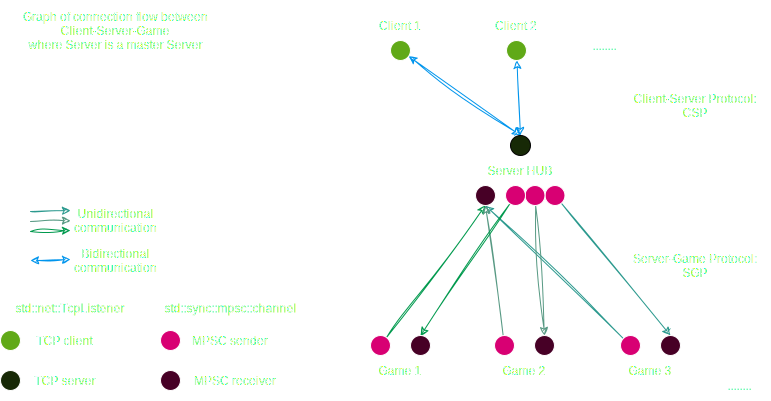
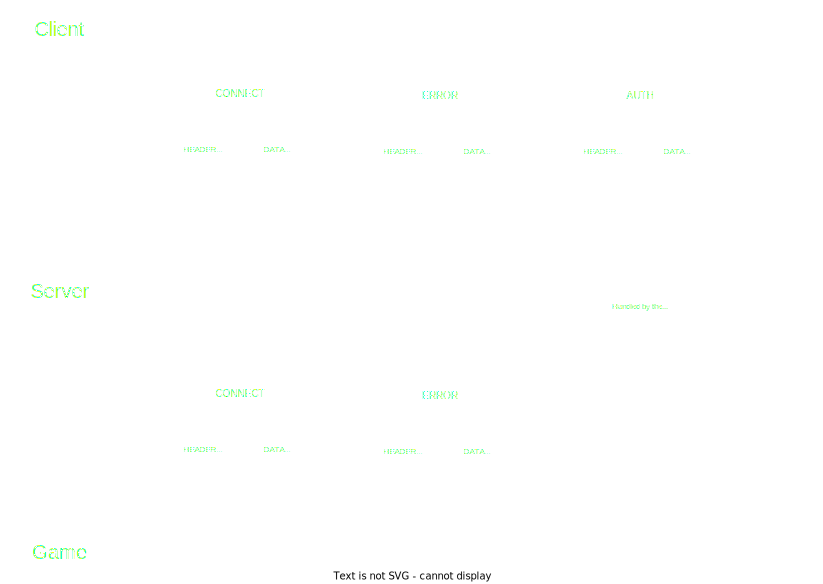

# Server
The code is located [here](/server/src/)

# Summary
  - [definitions](#definitions)
  - [communications](#communications)
    - [flow](#communication-flow)
    - [protocols](#communication-protocols)
## Definitions
  - `Server` refer to the Server HUB that manage `Games`, `Clients` and communications
  - `Game` refer to a game instance that handle the game logic (players, units, tchat...)
  - `Client` refer to the application that interact with a `Game` as a player

# Communications
## communication Flow
The Server act as a proxy between Games/Clients and use special protocols for communications :

FIXME : MASTER and SLAVES servers for load balancing huge servers hub 

## communication protocols
All communications are made trough custom protocoles over TCP/UDP or thread-channels.
- [Client-Server Protocol](./protocols/CSP.md)
- [Server-Game Protocol](./protocols/SGP.md)

