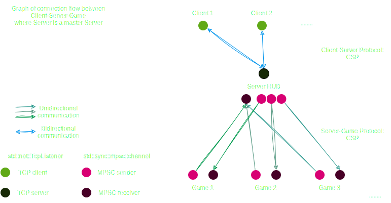

# Server

The code is located [here](/server/src/)

# Summary

- [definitions](#definitions)
- [communications](#communications)
    - [flow](#communication-flow)
    - [protocols](#communication-protocols)

## Definitions

- `Server` refer to the Server HUB that manage `Games`, `Clients` and communications
- `Game` refer to a game instance that handle the game logic (players, units, tchat...)
- `Client` refer to the application that interact with a `Game` as a player

# Communications

## communication Flow

The Server act as a proxy between Games/Clients and use special protocols for communications :

IDEA : MASTER and SLAVES servers for load balancing huge servers hub

## Communication protocols

All communications are made trough custom protocoles over TCP/UDP or thread-channels.

- [Client-Server Protocol](./csp/index.md)

## The database

For convenience, the database of the server is a single .sqlite file, where all games and users will be stored.

Each game will obviously have his own .sqlite file.

> Using another database such as MariaDB, SurrealDB and all other fantastic databases for bigger servers can be done,
> but we're not at this point for now.