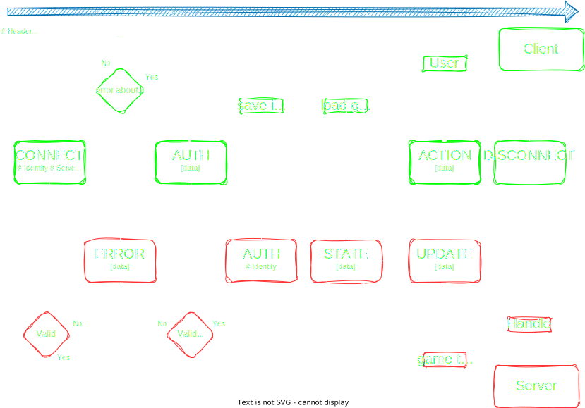
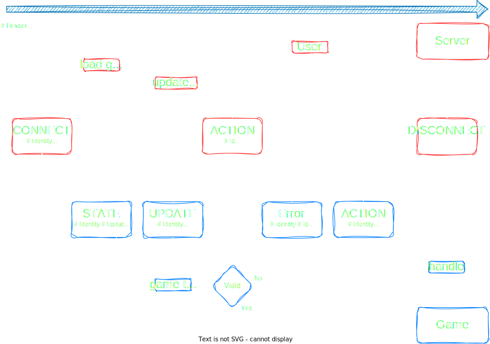
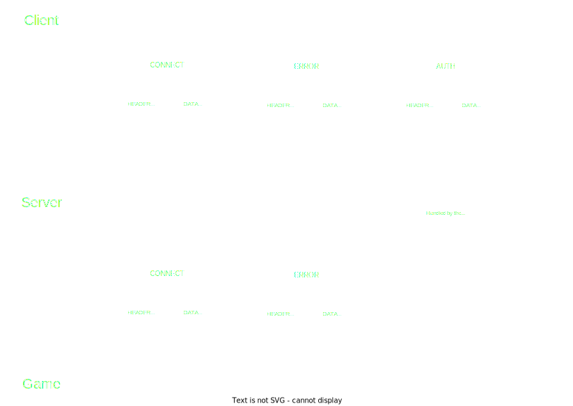

`Version 1.0`
# Client-Server Protocol (CSP)


- [Usage](#usage)
- [Control characters](#control-characters)
- [Header](#header)
  - [Version](#version)
  - [Method](#method)
    - [Connect](#method-connect)
    - [Auth](#method-auth)
    - [Disconnect](#method-disconnect)
    - [Admin](#method-admin)
    - [Update](#method-update)
    - [Action](#method-action)
    - [Error](#method-error)
    - [State](#method-status)
  - [Server](#server)
  - [Length](#length)
  - [Identity](#identity)
  - [Client](#client)
  - [Update](#update)
  - [Id](#id)
  - [Reconnect](#reconnect)
  - [Compressed](#compressed)
- [Data](#data)
  - [Compression](#compression)
- [Examples](#examples)
- [Flow](#flow)
- [Parsing Rules](#parsing-rules)
- [Parsinf Errors](#parsing-errors)

*note: every bytes values seen in this documentation is a decimal on 1 byte (0-255)*
## Usage
This protocol is used for communication between the Server the Client and the Game ([see definitions](../Server.md#definitions)).

The CSP follows a header-data message format, with reduced informations. Each message is called a `packet`.

The separation between header/data is made with [control char](#control-characters):

## Control characters
It's a special character, a single byte between 1 and 31 included.

They are used to do special things, like header delimitation, strings ...

 Name         | Value | Use Case
 ------------ | ----- | -------------------
 header_end   |  `1`  | specify the end of an header part
 string_start |  `2`  | specify the start of a string
 string_end   |  `3`  | specify the end of a string


## Header

The header is strictly constructed:
```
version method [headers] header_end ...
```
Where `[headers]` are key-value pairs, and both version and method are single byte values.

- A key is a single byte between 32 and 254 included
- A value is :
  - None, where a header is known as a boolean
  - a single byte between 32 and 254 included,
  - a 4 bytes numbers, serialized as a positive integrer in *little endian*
  - a 8 bytes numbers, serialized as a positive integrer in *little endian*
  - a variable length string, delimited by specials [control char](#control-characters). It's always an utf8 encoded string.

---------
### *Version*
Put a the very starts of a packet, it specify the it's csp version.

Csp versionning follows a strict pattern of `N.n` [e.g. 9.6, 3.0...] or `Nn` [e.g. 96, 30...] where `N` is a number between 1 and 9 and `n` between 0 and 9.

In a packet, it's represented as a strict single byte value, but internally, the software is free to use dotted versioning or not. 

When in a packet, the byte is between `32` and `121`. `32` represent csp v1.0 and `121` is v9.9.

So incrementing the byte, increment the version.
 
---------
### *Method*
As the second byte of a packet, it indicate what's the action performed by the packet.

 Name                             | Value | Sent By        | Description 
 -------------------------------- | ----- | -------------- | -------------
 [CONNECT](#method-connect)       | 32    | Client         | ask the server for connection to a game
 [AUTH](#method-auth)             | 33    | Client/Server  | `Server`: send client identity of the client<br>`Client`: send login informations
 [DISCONNECT](#method-disconnect) | 34    | Client/Server  | send a disconnection notice
 [ADMIN](#method-admin)           | 35    | Client/Server  | `Client`: send an admin action<br>`Server`: respond to an admin action
 [UPDATE](#method-update)         | 36    | Server         | send a game update
 [ACTION](#method-action)         | 37    | Client/Server  | `Client`: send game action<br>`Server`: respond to a game action
 [ERROR](#method-error)           | 38    | Client/Server  | send an error message
 [STATE](#method-state)           | 39    | Server         | send all informations about the game to allow initial loading of the client

### Method: *Connect*
Connect to the specified Server

- headers:
  - Required
    - [Server](#server) : to specify which server you want to join/connect
    - [Client](#client) : to recognize the client used, and check if compatible
  - Optional
    - [Identity](#identity) : if the client possess it, allow the server to immediatly log the client without asking an [auth](#method-auth)
    - [Update](#update) : if the client wants an update on configuration of the server ect..
- data: None

### Method: *Auth*
Request or try an authentification

This allow the Client to get his identity if an auth is successfull

*Server*: request the client to authenticate / validate that auth
- headers: 
  - Required : None
  - Optional
    - [Identity](#identity) : if **not** present, the Server ask for an authentification. If present, validate the authentification and give the identity for future connections
- data: None

*Client*: try to authenticate
- headers: 
  - Required
    - [Lentgh](#length) : data length
    - [Compressed](#compressed) : if the data is compressed
  - Optional : None
- data:
```json
{
  "passwd": "string: hashed password",
  "user": "string: username"
}
```

### Method: *Disconnect*
disconnect a client / the server

- headers:
  - Required:
    - [Lentgh](#length) : data length
    - [Compressed](#compressed) : if the data is compressed
  - Optional
    - [Reconnect](#reconnect) : if the client/server should keep the tcp stream open and just reset connection states (auth, packets awaiting for response...)
- data: 
```json
{
  "reason" : "string: reason of disconnection, can be printed to user"
}
```

### Method: *Admin*
Perform and admin action or validate a client Admin action. The reason of separation between action method is to efficintly filters privileged action

*Client*: Perform and admin action
- headers:
  - Required
    - [Lentgh](#length) : data length
    - [Compressed](#compressed) : if the data is compressed
    - [Id](#id) : that packet awaits a reponse, id will be specified in the reponse header
  - Optional: None 
- data:
```json
{
  // TODO Admin data 
}
```
*Server*: validate a client Admin action
- headers:
  - Required
    - [Id](#id) : action validated
  - Optional: None 
- data: None 

### Method: *Update*
Send an event to the client.

- headers:
  - Required
    - [Lentgh](#length) : data length
    - [Compressed](#compressed) : if the data is compressed
  - Optional
- data:
```json
{
  // TODO Update data
}
```

### Method: *Action*
Perform and action or validate a client action

*Client*: Perform and action
- headers:
  - Required
    - [Lentgh](#length) : data length
    - [Compressed](#compressed) : if the data is compressed
    - [Id](#id) : that packet awaits a reponse, id will be specified in the reponse header
  - Optional: None 
- data:
```json
{
  // TODO Action data 
}
```
*Server*: validate a client action
- headers:
  - Required
    - [Id](#id) : action validated
  - Optional: None 
- data: None 

### Method: *Error*
When encoutering a parsing error or generic error from a packet.

- headers:
  - Required
    - [Lentgh](#length) : data length
    - [Compressed](#compressed) : if the data is compressed
  - Optional
    - [Id](#id) : packet that generated that error
- data: 
```json
{
  "pos": "number: the position where the error happened. is present, mean that's a PARSE error",
  "message": "string: generic message that can be logged oor printed to the user",
  "id": "string: short identifier that allow a program to handle specific error"
}
```

### Method: *State*
Send an initial sate of the game when an user join it, or send heavy data. can be sent chunker

- headers:
  - Required
    - [Lentgh](#length) : data length
    - [Compressed](#compressed) : if the data is compressed
  - Optional
- data:
```json
{
  // TODO Update data
}
```

- headers:
  - Required
  - Optional

---------
### *Server*
The game's id

- **Key**: `32`

- **Sent by**: Server/Client

- **Value Type**: 4 bytes number

- **Values**: all numbers which are a valid server id

- **Example**: `1101` u32 => `077 004 000 000` little endian bytes

---------
### *Length*
Tells the length of the `data` part.

- **Key**: `33`

- **Sent by**: Server/Client

- **Value Type**: 8 bytes number

- **Values**: all numbers

- **Example**: `5000` u64 => `136 019 000 000 000 000 000 000` little endian bytes

---------
### *Identity*

The player identity as a 32 bytes string

Used in the [`connect`](#method-connect) method to identify the player

Identity is a server-generated unique id which serve the purpose of *identify*ing the client by the server. It is linked to the player's credentials to allow the retrieval with correct credential of this id with an [`auth`](#method-auth) method sent by the client.<br>
When retrieved, the client should save it for further usage in the [`connect`](#method-connect) request to skip the [`auth`](#method-auth) requests.

- **Key**: `34`

- **Sent by**: Client/Server

- **Value Type**: string

- **Example**: `abc` string => `002 097 098 099 003` bytes

---------
### *Client*
Define the client's version and others informations for the server compatibility/logging

TODO define a specification

- **Key**: `35`

- **Sent by**: Client

- **Value Type**: string

- **Values**: compatible client information

- **Example**: `1.0.3-aegis-linux` string => `002 049 046 048 046 051 045 097 101 103 105 115 045 108 105 110 117 120 003` bytes

---------
### *Update*
If the Client needs an update about the overrided config/assets, mods or game.

The server will transmit them in the following [`sate`](#method-state) method

- **Key**: `35`

- **Sent by**: Client

- **Value Type**: Boolean

---------
### *Id*
Used in the [`action`](#method-action) and [`admin`](#method-admin) methods to identify an action and associate an error status or validate the action

- **Key**: `37`

- **Sent by**: Client/Server

- **Value Type**: 8 bytes number

- **Example**: `5000` u64 => `136 019 000 000 000 000 000 000` little endian bytes

---------
### *Reconnect*
Sent in the [`disconnect`](#method-disconnect) method to notify the client that he should close the connection then try to reconnect

- **Key**: `38`

- **Sent by**: Server

- **Value Type**: Boolean

---------
### *Compressed*
Sent in a packet which contains data, used to indicate if a data part has been compressed. It does not certify the presence of data in the packet, only the [Length](#length) is used for that.

- **Key**: `39`

- **Sent by**: Server

- **Value Type**: Boolean

## Data
The data part is gathered only if the [Length](#length) header is set. It can be anything depending of the packet or the csp version, but usually, for structured data, it's serialized using [msgpack](https://msgpack.org). It can also be raw data for files, or compressed data.

```
packet... header_end [data]
```


### Compression
The compression of a data part is done using [gzip](https://www.gnu.org/software/gzip/manual/gzip.html).

## Examples
Each examples shows a packet (which may or may not be a valid one) with two lines: raw bytes (`>`), and bytes meanings (`|`). e.g. :
```
> 032  038   001
| v1.0 ERROR end
```

### CONNECT packet 
```
> 032  032     032     001 000 000 000 035     034       002 097 098 099 003
| v1.0 CONNECT #Server               1 #Update #Identity   "   a   b   c   "

> 035     002 049 046 048 046 051 045 097 101 103 105 115 045 108 105 110 117 120 003 001
| #Client   "   1   .   0   .   3   -   a   e   g   i   s   -   l   i   n   u   x   " end
```

So, the packet is asking: 
> "Hey, we will talk in `v1.0`. Can I **CONNECT** to the **Server** `1` ? I'm using **Client** `1.0.3-aegis-linux`, and you knows my **Identity** under `abc`. Also, it's my first connection, can you send **Update**s of it's configuration?" 

In JSON it can be serialized as: 
```json
{
  "version": "1.0",
  "method": "connect",
  "headers": {
    "server": 1,
    "update": true,
    "client": "1.0.3-aegis-linux",
    "identity": "abc"
  }
}
```

### ERROR packet
```
> 032  038   033     055 000 000 000 000 000 000 000 037 137 019 000 000 000 000 000 000 001
| v1.0 ERROR #Length                              55 #Id                            5001 end

> 131 163 112 111 115 015 167 109 101 115 115 097 103 101 186 068 117 112 108 105 099 097 116 101 100 032 104
> 101 097 100 101 114 058 032 115 101 114 118 101 114 046 162 105 100 170 068 085 080 095 072 069 065 068 069 082
| ...data as msgpack...
```

So, the packet is saying: 
> "Hey, we will talk in `v1.0`. I encoutered an **ERROR** in the packet with **Id** `5001` .. Here is some data describing it, it's **Length** is `55` bytes." 

In JSON it can be serialized as: 
```json
{
  "version": "1.0",
  "method": "error",
  "headers": {
    "length": 55,
    "id": 5001
  },
  "data": {
    "id": "DUP_HEADER",
    "pos": 15,
    "message": "Duplicated header: server."
    }
}
```

---------
## Flow
Example of a basic connection between a Client and a Server, displaying the methods used



Example of a basic connection between a Server and a Game, displaying the methods used



The differences between a server-client CSP packet and server-game CSP packet


## Parsing Rules
TODO define parsing rules

## Parsing Errors

All parsing error should be reported in an [ERROR](#method-error) packet, whith data as 3 values:
  - pos: the position where you encounter the problem
  - message: a formated error message to provide quick understanding of the matter
  - id: a fixed short value to allow any program to understand the error

 Error                | Id                | Example of message                              | Explanation 
 -------------------- | ----------------- | ----------------------------------------------- | ------------- 
 duplicate header     | `DUP_HEADER`      | Duplicated header: id.                          | headers are uniques and cannot be set more than once
 unknown header       | `UKWN_HEADER`     | Unknown header: 065.                            | if you encounter a value between [header range](#header) with no header associated
 unknown value        | `UKWN_VAL`        | Unknown value for [method]: 090.                | if you encounter a value between [header value range](#header) with no value associated
 unknown control      | `UKWN_CTRL`       | Unknown control: 09.                            | if you encounter a value between [control range](#control-characters) with no control associated
 missing control      | `MISS_CTRL`       | Missing control: header_end.                    | if a control is not found where expected, eg header_end even so all buffer has been consumed
 unexpected control   | `UNXPT_CTRL`      | Unexpected control: string_end.                 | if a control is found in a place where it shouldn't be, eg an unexpected string_start 
 invalid number       | `INV_NUM`         | Invalid number: expected 8 bytes, found 6.      | invalid number, eg the buffer ends before the number is complete
 invalid data length  | `INV_DATA_LEN`    | Invalid length header, data length mismatch it. | Length header should be exactly the length of the data 
 invalid str          | `INV_STR`         | Invalid utf-8 string                            | when parsing an header string goes wrong
 timed out            | `TIMEDOUT`        | cannot gather the rest of the packet: timed out | when receiving a packet, sometimes you can wait for the rest and never get it, usually means it's corrupted
 unknown              | `UNKNOWN`         | *                                               | every other error, that don't have a proper id to report.