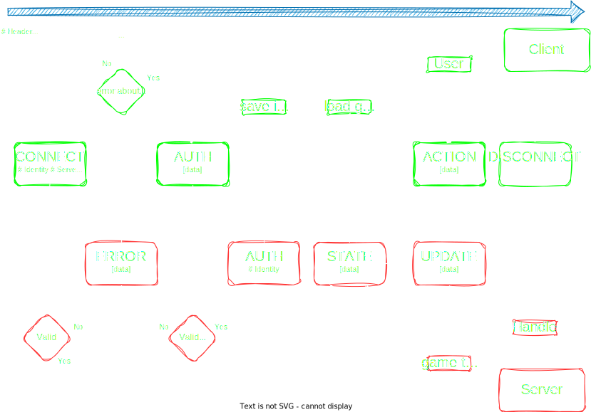
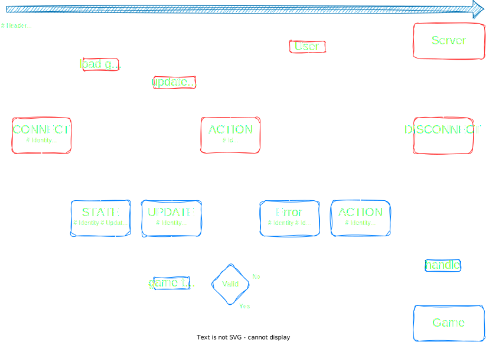

# Client-Server Protocol (CSP)
`Version 1.0`

- [Usage](#usage)
- [Header](#header)
  - [Control characters](#control-characters)
  - [keys](#header-keys)
- [Data](#data)
- [Examples](#examples)
- [Flow](#flow)
- [Rules](#rules)
- [Errors](#errors)

*all bytes represented in the following documentation are decimals*


## Usage 
This protocol is used for communication between the Server the Client and the Game ([see definitions](../Server.md#definitions)).

The CSP follows a header-data message format, with reduced informations. Each message is called a `packet`.

The separation between header/data is made with [control char](#control-characters):
```
[header] 1 2 [data]
```
it's mandatory to mark the end of an header otherwises it's concidered as a corrupted packet.

if no start of data control is found, it means that no data has been sent with the packet.

## header
the header use a key-value pair with optimisation in mind:
  - a key is a single value between 32 and 255
  - a value is defined depending of the associated key:
    - **None**: if the key does not need a value
    - **single byte value**: an enum value between 32 and 255
    - **4 bytes number**: an unsigned number stored as *little endian* (see the [csp example parser](./example/csp.lua) if need hints on how it works)
    - **8 byte number**: same as 4 byte number with more bytes for larger numbers
    - **string**: a way to pass unknown length value, it starts with `string_start` control and ends with `string_end` control.<br>
    everything contained between the controls bytes must be valid utf8/ascii values


## Control characters
They are contained between 1 and 31 and define special behavior for the packet, such as header delimitation, value formating...
- `1` : end of header (`header_end`)
- `2` : start of data (`data_start`)
- `3` : start of string (`string_start`)
- `4` : end of string (`string_end`)

## header keys
name|value
----|-----
[METHOD](./headers/method.md) | 32
[SERVER](./headers/server.md) | 33
[LENGTH](./headers/length.md) | 34
[IDENTITY](./headers/identity) | 35
[VERSION](./headers/version.md) | 36
[UPDATE](./headers/update.md) | 37
[ID](./headers/id.md) | 38
[RECONNECT](./headers/reconnect.md) | 39
[CSP](./headers/csp.md) | 40

## Data
 TODO : define data

## Examples
All examples use a raw byte-separates format using decimal values

### CONNECT packet
A connect packet would look like this: 
```
32 32 33 48 48 48 49 01
```
the first 2 bytes is the [METHOD](./headers/server.md) key-pair:
- `32` : METHOD key
- `32` : CONNECT value

the following byte (`33`) is the [SERVER](./headers/server.md) key, which is a 4 bytes value:
- `33` : SERVER key
- `48 48 48 49` : in ascii is `0001` which is the hexadecimal number 1

the last byte (01) is the [control char](#control-characters) telling the end of the header

note: *the above packet do not handle authentification, which is made with [identify](./headers/identity.md) header, and would trigger and AUTH request*

a valid connection packet would be:
```
32 32 33 48 48 48 49 35 03 [...] 04 01
```

where we have added `35 03 [...] 04`:
- `35` : IDENTITY key
- `O3` : string_start
- `[...]` : identity string
- `04` : string_end

 TODO : define more CSP examples

You can read a basic example [here](./example/)

## Flow
This is an example of a basic connection between a Client and a Server, displaying the methods used



This is an example of a basic connection between a Server and a Game, displaying the methods used



This is the differences between a server-client CSP packet and server-game CSP packet


## Rules
  - each *header* can only be set once by packet
  - an unknown value is concidered as corrupted packet
  - if some [data] is present, [`length`](./headers/length.md) method should be present
TODO

## Errors

All parsing error should be reported in a string format, with 3 values:
  - pos: the position where you encounter the problem
  - message: a formated error message to provide quick understanding of the matter
  - id: a fixed short value to allow any program to understand the error


 Error                | Id                | Example of message                              | Explanation 
 -------------------- | ----------------- | ----------------------------------------------- | ------------- 
 duplicate header     | `DUP_HEADER`      | Duplicated header: method.                      | headers are uniques and cannot be set more than once
 unknown header       | `UKWN_HEADER`     | Unknown header: 065.                            | if you encounter a value between [header range](#header) with no header associated
 unknown header value | `UKWN_HEADER_VAL` | Unknown value for [method]: 090.                | if you encounter a value between [header value range](#header) with no value associated
 unknown control      | `UKWN_CTRL`       | Unknown control: 09.                            | if you encounter a value between [control range](#control-characters) with no control associated
 missing control      | `MISS_CTRL`       | Missing control: header_end.                    | if a control is not found where expected, eg header_end even so all buffer has been consumed
 unexpected control   | `UNXPT_CTRL`      | Unexpected control: data_start.                 | if a control is found in a place where it shouldn't be, eg a data_start before a header_end
 invalid number       | `INV_NUM`         | Invalid number: expected 8 bytes, found 6.      | invalid number, eg the buffer ends before the number is complete
 invalid data length  | `INV_DATA_LEN`    | Invalid length header, data length mismatch it. | Length header should be exactly the length of the data 
 invalid_str          | `INV_STR`         | Invalid utf-8 string                            | when parsing an header string goes wrong
 timed out            | `TIMEDOUT`        | cannot gather the rest of the packet: timed out | when receiving a packet, sometimes you can wait for the rest and never get it, usually means it's corrupted
 unknown              | `UNKNOWN`         | *                                               | every other mistakes, that don't have a proper id to report.