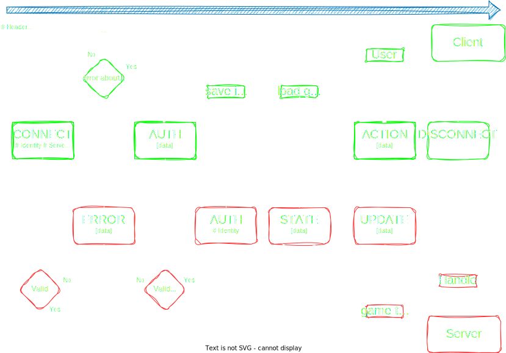

# Client-Server Protocol (CSP)
- [Header](#header)
  - [Control characters](#control-characters)
  - [keys](#header-keys)
- [Data](#data)
- [Examples](#examples)
- [Flow](#flow)

*all bytes represented in the following documentation are decimals*

The CSP follows a header-data message format, with reduced informations. Each message is called a `packet`.

The separation between header/data is made with [control char](#control-characters):
```
[header] 1 2 [data]
```
it's mandatory to mark the end of an header otherwises it's concidered as a corrupted packet

if no start of data control is found, it means that no data has been sent with the packet

## header
the header use a key-value pair with optimisation in mind:
  - a key is a single value between 32 and 255
  - a value is defined depending of the associated key:
    - **None**: if the key does not need a value
    - **single byte value**: an enum value between 32 and 255
    - **4 bytes number**: a positive number represented as an ascii hex. eg: `48 97 102 50` == 0af2 (2802)
    - **8 byte number**: same as 4 byte number with more bytes for larger numbers
    - **string**: a way to pass unknown length value, it starts with `string_start` control and ends with `string_end` control.<br>
    everything contained between the controls bytes must be valid utf8/ascii values


## Control characters
They are contained between 1 and 31 and define special behavior for the packet, such as header delimitation, value formating...
- `1` : end of header (`header_end`)
- `2` : start of data (`data_start`)
- `3` : start of string (`string_start`)
- `4` : end of string (`string_end`)

## header keys
name|value
----|-----
[METHOD](./headers/method.md) | 32
[SERVER](./headers/server.md) | 33
[LENGTH](./headers/length.md) | 34
[IDENTITY](./headers/identity) | 35
[VERSION](./headers/version.md) | 36
[UPDATE](./headers/update.md) | 37

## Data
 TODO : define data

## Examples
All examples use a raw byte-separates format using decimak values

### CONNECT packet
A connect packet whould look like this: 
```
32 32 33 48 48 48 49 01
```
the first 2 bytes is the [METHOD](./headers/server.md) key-pair:
- `32` : METHOD key
- `32` : CONNECT value

the following byte (`33`) is the [SERVER](./headers/server.md) key, which is a 4 bytes value:
- `33` : SERVER key
- `48 48 48 49` : in ascii is `0001` which is the hexadecimal number 1

the last byte (01) is the [control char](#control-characters) telling the end of the header

note: *the above packet do not handle authentification, which is made with [identify](./headers/identity.md) header, and would trigger and AUTH request*

a valid connection packet would be:
```
32 32 33 48 48 48 49 35 03 [...] 04 01
```

where we have added `35 03 [...] 04`:
- `35` : IDENTITY key
- `O3` : string_start
- `[...]` : identity string
- `04` : string_end

## Flow
This is an example of a basic connection between a Client and a Server, displaying the methods used


